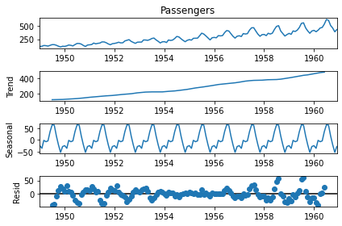

# 시계열 예측 시 고려해야 할 사항 

## 데이터 샘플 수 (The quantity consideration)
- 데이터 샘플 수가 적을수록 예측의 품질이 크게 저하될 수 있다. 
- 정확한 예측을 생성하기 위해, 시계열의 필수 요소(추세/Trend, 레벨/Level, 계절성/Seasonality)를 포착하기 위한 적절한 양의 샘플이 필요하다.

## 집계 (The aggregation consideration)
- 집계된 데이터의 분산이 적고 노이즈가 적기 때문에, 집계 수준이 높을수록 더 정확한 예측을 제공한다. 
- 따라서 매우 세분화된 수준에서 예측을 염두에 두어야 한다.

## 업데이트 (The update consideration)
- 모든 새로운 정보를 포착하기 위해 예측을 정기적으로 업데이트해야 하는 장기적인 동작에 적용된다. 
- 업데이트 빈도가 너무 낮으면, 주변 환경의 변화와 향후 예측에 대한 의도된(혹은 의도되지 않은) 영향을 포착하지 못할 수 있다.

## 한계 인식 (The horizon consideration)

- 문제를 정의할 때 예측 한계(미래 예측 창)도 인식해야 한다. 
- 미래로 나아갈수록 예측에 대해 더 불확실해질 가능성이 높다.

# 시계열 데이터의 구성요소

## Level (레벨)

- 시계열의 기준선이다.
- 이것은 우리가 다른 구성 요소를 추가하는 기준선을 제공한다.

## Trend (추세)

- 장기간에 걸쳐 시계열이 더 낮아지거나 높아지는지 여부를 나타낸다.

## Seasonality (계절성)

- 일정 기간 동안 반복되는 시계열 데이터의 패턴이다.

## Cyclicity (주기성)

- 주기적으로 반복되는 데이터의 반복 패턴.

## Noise (노이즈)

- 데이터에 존재하는 완전히 무작위적인 변동
- 이 구성 요소를 사용하여 미래를 예측할 수 없다. 
- 이것은 아무도 설명할 수 없고 완전히 무작위적인 시계열 데이터의 구성 요소이다.

# 시계열 분해

시계열에서 구성 요소를 추출하기 위해 시계열 분해를 수행할 수 있다. 
- 분해는 가산적이거나 승산적일 수 있다
    - 즉, 원래 시계열을 얻기 위해 다른 구성요소를 추가하거나 곱할 수 있음.


```python
import pandas as pd
import statsmodels.api as sm
from matplotlib import pyplot as plt

df = pd.read_csv('airline-passengers.csv', parse_dates=['Month'], index_col=['Month'])
# df['Month'] = pd.to_datetime(df['Month'], format='%Y-%m')
# df = df.set_index('Month')
ad_decomposition = sm.tsa.seasonal_decompose(df.Passengers, model='additive')  # additive seasonal index
fig = ad_decomposition.plot()
plt.show()
```


    

    


# 시계열 전처리

## 결손값 처리

### 평균으로 채우기

- 결손값을 데이터의 전체 평균으로 채다.

### 마지막 관측값으로 채우기

- 결손값을 데이터의 이전 값으로 채운다.

### 선형 보간

- 데이터에서 결손값의 다음 점과 이전 점을 연결하는 직선을 그린다.

### 계절성 + 선형 보간 

- 이 방법은 추세와 계절성이 있는 데이터에 가장 적합하다.
- 결손값은 결손값의 이전 계절 기간과 다음 계절 기간의 해당 데이터 포인트의 평균으로 채운다.

보간에 활용할 수 있는 다른 보간 방법에는 다항식 보간(polynomial interpolation), 무게 중심 보간(라그랑주 다항식 보간의 변형)(barycentric interpolation), 조각별 다항식(piecewise polynomial), 스플라인(spline) 등이 있다.

## 이상값 처리

이상값을 감지하기 위해 
- 시각적 기술(예: boxplots, scatterplots, histograms, distribution plots)
- 정량적 기법(예: IQR 또는 5분위수 분석)

을 사용할 수 있습니다. 

### 이상값 처리 방법

- 이상값 제거
    - 이상값 삭제
- 이상값 제한(capping)
    - 최대값과 최소값을 미리 정의된 임계값으로 제한한다.
- 이상값 구간화(binning)
    - 데이터를 구간으로 나누는 것을 통해 이상값의 영향을 줄일 수 있다.
    - 마치 결정트리가 이상값에 영향을 덜 받는 것과 비슷한 이치이다.
